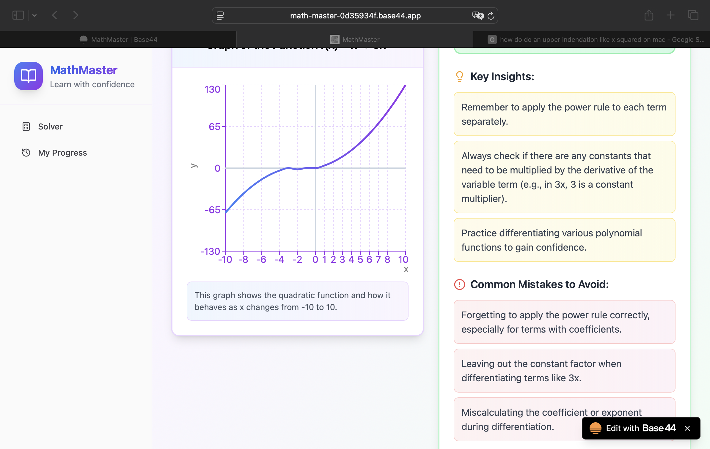

# 📚 MasterMath

> **A privacy-focused educational math solver that helps students master precalculus and calculus concepts through step-by-step solutions.**

🌐 **Live at [mastermath.app](https://mastermath.app)**

[](https://github.com/sparkinCreations/MasterMath)
[](https://opensource.org/licenses/MIT)
[](https://reactjs.org/)
[](https://vitejs.dev/)



## 🌟 Features

### 🧮 **Comprehensive Math Solver**
- **Derivatives & Differentiation** - Step-by-step calculus solutions
- **Integrals & Integration** - Detailed integration processes  
- **Limits** - Limit calculations with explanations
- **Algebra** - Equation solving and simplification
- **Trigonometry** - Trig function solutions
- **Functions & Graphing** - Visual function analysis
- **Arithmetic** - Basic mathematical operations

### 📊 **Visual Learning**
- **Interactive Graphs** - Visualize functions and solutions
- **Step-by-Step Explanations** - Understand the process, not just the answer
- **Common Mistakes Warnings** - Learn what to avoid
- **Educational Tips** - Contextual learning guidance

### 🔒 **Privacy-First Design**
- **100% Client-Side** - No data sent to servers
- **Local Storage** - Your problems stay on your device
- **No Account Required** - Start solving immediately
- **Export Functionality** - Save your work locally

### 🎨 **Modern User Experience**
- **Dark/Light Mode** - Comfortable viewing in any environment
- **Responsive Design** - Works on desktop, tablet, and mobile
- **Progress Tracking** - Monitor your learning journey
- **Clean Interface** - Focus on learning, not distractions

## 🚀 Quick Start

### Prerequisites
- Node.js 18+ 
- npm or yarn

### Installation

```bash
# Clone the repository
git clone https://github.com/sparkinCreations/MasterMath.git
cd MasterMath

# Install dependencies
npm install

# Start development server
npm run dev

# Build for production
npm run build
```

### Usage

1. **Enter a Math Problem** - Type any precalculus or calculus problem
2. **Select Topic** - Choose the appropriate mathematical category
3. **Get Step-by-Step Solution** - Review detailed explanations
4. **Visualize Results** - View graphs when applicable
5. **Learn & Verify** - Always double-check solutions independently

## 🏗️ Technology Stack

### **Frontend Framework**
- **React 18.3.1** - Modern UI library with hooks
- **Vite** - Fast build tool and development server
- **React Router** - Client-side routing

### **Math Libraries**
- **Algebrite** - Symbolic calculus and algebra
- **MathJS** - Expression parsing and evaluation
- **mathsteps** - Step-by-step algebraic solutions

### **Styling & UI**
- **Tailwind CSS** - Utility-first styling
- **shadcn/ui** - Modern component library
- **Lucide React** - Icon system
- **Framer Motion** - Animations

### **Charts & Visualization**
- **Recharts** - Interactive function graphs

### **Storage & Export**
- **IndexedDB** - Browser-based local storage
- **jsPDF** - PDF generation for exports

## 📖 How It Works

MasterMath uses **local JavaScript math libraries** (not AI) to solve problems:

1. **Math Parser** extracts expressions from natural language input
2. **Topic Router** directs problems to the appropriate solver
3. **Solver Engines** compute solutions using mathjs, algebrite, and mathsteps
4. **Solution Formatter** generates step-by-step explanations, tips, and graphs
5. **Local Storage** saves your history in the browser (IndexedDB)

All computations happen **entirely in your browser** - no data is sent to external servers.

## 📖 Educational Philosophy

MasterMath is designed as a **learning companion**, not a homework shortcut:

### ✅ **Use For:**
- Understanding solution steps
- Verifying your work
- Learning problem-solving patterns
- Building mathematical intuition

### ⚠️ **Important:**
- Always verify solutions independently
- Use as a learning aid, not a replacement for practice
- Respect your institution's academic integrity policies

## 🗂️ Project Structure

```
MathMaster/
├── 📄 Configuration
│   ├── index.html              # Main entry point
│   ├── package.json            # Dependencies and scripts
│   ├── vite.config.js          # Vite build configuration
│   ├── tailwind.config.js      # Tailwind CSS configuration
│   └── postcss.config.js       # PostCSS configuration
│
├── 🎨 Source Code (src/)
│   ├── main.jsx                # React entry point
│   ├── App.jsx                 # Root component with providers & routes
│   ├── Layout.jsx              # Main layout with sidebar navigation
│   ├── index.css               # Global styles
│   │
│   ├── components/
│   │   ├── ErrorBoundary.jsx   # Error boundary component
│   │   ├── solver/             # Solver-specific components
│   │   │   ├── ProblemInput.jsx     # Problem input form
│   │   │   ├── SolutionDisplay.jsx  # Solution with steps & tips
│   │   │   └── GraphViewer.jsx      # Function graph visualization
│   │   └── ui/                 # shadcn/ui components
│   │       ├── button.jsx
│   │       ├── card.jsx
│   │       ├── sidebar.jsx
│   │       ├── toast.jsx
│   │       └── ...             # Other UI components
│   │
│   ├── pages/
│   │   ├── Home.jsx            # Landing page
│   │   ├── Solver.jsx          # Main problem solver interface
│   │   ├── Progress.jsx        # History & statistics
│   │   ├── UserManual.jsx      # Documentation
│   │   ├── FAQ.jsx             # Frequently asked questions
│   │   ├── Feedback.jsx        # User feedback form
│   │   ├── PrivacyPolicy.jsx   # Privacy policy
│   │   └── TermsOfService.jsx  # Terms of service
│   │
│   ├── lib/
│   │   ├── api.js              # Main API for solving & storage
│   │   ├── indexedDB.js        # IndexedDB wrapper
│   │   ├── mathParser.js       # Expression parsing utilities
│   │   ├── exportUtils.js      # Export to PDF/CSV/JSON/Markdown
│   │   ├── validation.js       # Input validation utilities
│   │   ├── utils.js            # General utilities
│   │   └── solvers/            # Topic-specific math solvers
│   │       ├── algebraSolver.js
│   │       ├── derivativesSolver.js
│   │       ├── integralsSolver.js
│   │       ├── arithmeticSolver.js
│   │       └── otherSolvers.js      # Limits, trig, functions
│   │
│   ├── contexts/
│   │   └── DarkModeContext.jsx # Dark mode state management
│   │
│   ├── hooks/
│   │   └── usePageTitle.js     # Custom hook for page titles
│   │
│   ├── entities/
│   │   └── ProblemHistory.json # IndexedDB schema definition
│   │
│   └── utils/
│       └── index.js            # Utility functions
│
├── 📁 Public Assets (public/)
│   ├── favicon.svg             # App icon
│   ├── favicon.png             # PNG favicon
│   ├── manifest.json           # PWA manifest
│   ├── robots.txt              # Search engine directives
│   ├── sitemap.xml             # Site map
│   ├── og-image.jpg            # Open Graph image
│   └── twitter-image.jpg       # Twitter card image
│
└── 📚 Documentation
    ├── README.md               # This file
    ├── CLAUDE.md               # Claude Code project instructions
    ├── CONTRIBUTING.md         # Contribution guidelines
    ├── CHANGELOG.md            # Version history
    ├── DEPLOYMENT.md           # Deployment instructions
    ├── SECURITY.md             # Security policy
    └── LICENSE                 # MIT license
```

## 🤝 Contributing

We welcome contributions from the community! Please see our [Contributing Guidelines](CONTRIBUTING.md) for details.

### **Ways to Contribute:**
- 🐛 **Bug Reports** - Find and report issues
- ✨ **Feature Requests** - Suggest new functionality
- 📝 **Documentation** - Improve guides and examples
- 🧮 **Math Solvers** - Add new mathematical topics
- 🎨 **UI/UX** - Enhance user experience
- 🧪 **Testing** - Add test coverage

### **Development Setup:**
1. Fork the repository
2. Create a feature branch: `git checkout -b feature/amazing-feature`
3. Make your changes and test thoroughly
4. Commit with clear messages: `git commit -m 'Add amazing feature'`
5. Push to your fork: `git push origin feature/amazing-feature`
6. Open a Pull Request

## 📄 License

This project is licensed under the MIT License - see the [LICENSE](LICENSE) file for details.

## 🏢 About sparkinCreations™

MasterMath is developed by [sparkinCreations™](https://sparkincreations.com), committed to creating educational tools that promote learning and understanding.

### **Contact:**
- 🌐 **Website:** [sparkincreations.com](https://sparkincreations.com)
- 📧 **Email:** admin@sparkincreations.com
- 💬 **Issues:** [GitHub Issues](https://github.com/sparkinCreations/MasterMath/issues)

## 🙏 Acknowledgments

- **Math Libraries** - Algebrite, MathJS, and mathsteps communities
- **UI Framework** - React and Vite teams
- **AI Assistance** - Claude (Anthropic) for development support
- **Open Source** - All the amazing libraries that make this possible

## ⚠️ Important Notice

**MasterMath is an educational tool designed to help students learn mathematical concepts. All computations are performed using JavaScript math libraries (not AI). Always verify solutions independently and respect your institution's academic integrity policies.**

---

**Made with ❤️ by sparkinCreations™ • Powered by ⚛️ React**

*Master math with confidence!*